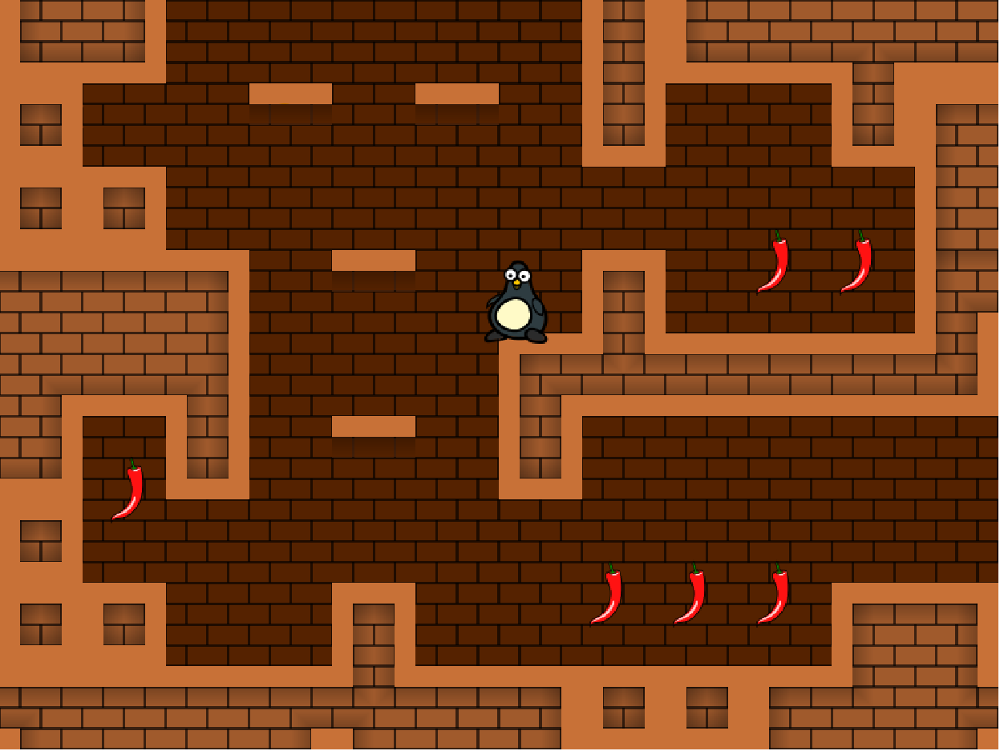

# js-tile-game-engine

## Description

(Etremely) Basic tile-based game engine written in JavaScript.



## Features

* Keyboard controls
    * Left/right: move
    * Up: jump
* Items
    * Animated
    * Pickable
    * Counter
* Levels
    * Multiple rooms (1 per screen)


## Usage

To test the example game, simply load the ```index.html``` file in the browser
