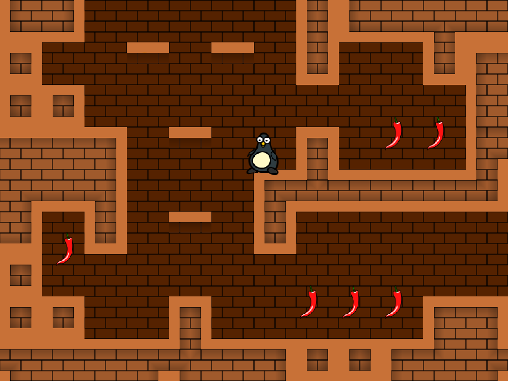

# js-tile-game-engine



## Description

Tile-based game engine written in JavaScript.

The project serves as a JavaScript learning exercise as well as understanding and experimenting game development aspects (essentially about 2D platformers).


## Features

The project is still in a very basic state, only implementing a minimum set of features:

* Game loop
* Items
    * Animated
    * Pickable
    * Counter
* Keyboard controls
    * Left/right: move
    * Up: jump
* Level (only 1 for now)
    * Multiple rooms (1 per screen) (no scrolling)
    * Loaded from description (JSON format)

A long list of other features is required, some of them specified in the [TODO](TODO.md) document.


## Usage

To test the example game, simply load the ```index.html``` file in the browser


## Demo

The game can be played [here](https://2-rec.github.io/js-tile-game-engine/).
